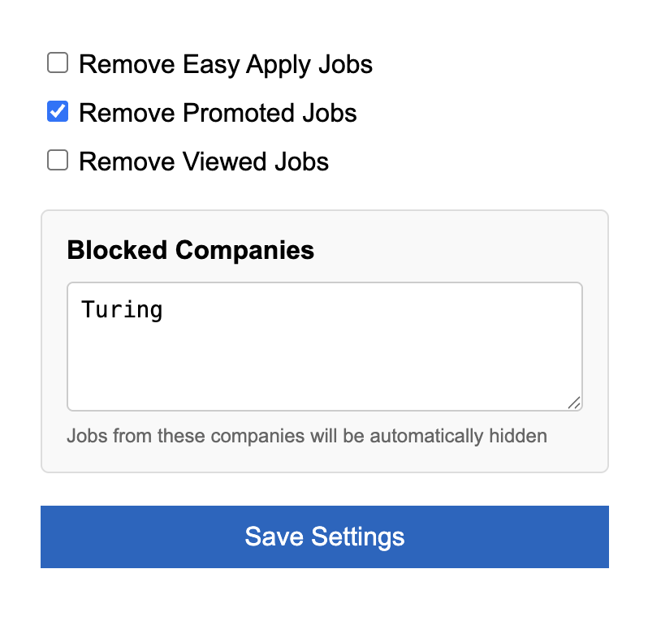

# LinkedIn Filters Extended

A Chrome extension that enables powerful filtering on LinkedIn Jobs search results.

_Configure filters and block companies with an intuitive interface_

## Features

- ✅ **Remove Easy Apply Jobs**: Filter out jobs with easy apply
- ✅ **Remove Promoted Jobs**: Hide promoted job listings
- ✅ **Remove Viewed Jobs**: Hide jobs you've already viewed
- 🚫 **Block Companies**: Automatically hide jobs from specific companies (e.g., Apple, Amazon, Google)
- 🔄 **Auto-filtering**: Works automatically on page load and pagination - no need to click the extension every time!

## Installation

### From Release (Recommended)

1. Go to [Releases](https://github.com/atulkadian/linkedin-extended/releases)
2. Download the latest `.zip` file
3. Extract the contents
4. Open Chrome and navigate to `chrome://extensions/`
5. Enable "Developer mode" (toggle in top-right)
6. Click "Load unpacked" and select the extracted folder

### From Source

1. Clone this repository
2. Open Chrome and navigate to `chrome://extensions/`
3. Enable "Developer mode"
4. Click "Load unpacked" and select the cloned directory

## Usage

1. Visit any LinkedIn Jobs page (e.g., https://www.linkedin.com/jobs/search/)
2. Click the extension icon in your Chrome toolbar
3. Configure your preferences:
   - Check/uncheck filter options
   - Add company names to block (one per line)
4. Click "Save Settings"
5. The filters will automatically apply!

## Privacy

This extension:

- ✅ Works entirely locally in your browser
- ✅ Does NOT collect any data
- ✅ Does NOT send any information to external servers
- ✅ Only stores your filter preferences locally using Chrome's storage API

## Permissions

- `activeTab`: To access the current LinkedIn tab
- `storage`: To save your filter preferences
- `scripting`: To apply filters to the page

## Contributing

Contributions are welcome! Please feel free to submit a Pull Request.

## License

MIT License - feel free to use and modify as needed.
